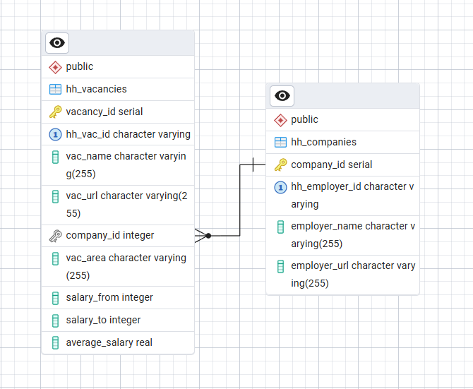

# Проект "HeadHunterVacancyDataBase"

## Описание:

"HeadHunterVacancyDataBase" является учебным проектом по Python-разработке. 

Проект содержит код для разработки приложения поиска и получения информации о вакансиях с платформы HeadHunter.ru 
в России.
В проекте собрана информация об открытых вакансиях 10 компаний, входящих в рейтинг крупнейших работодателей 
на территории России по версии сайта HeadHunter.ru (https://rating.hh.ru/history/rating2024):
- Avito, 
- Точка банк, 
- Купер, 
- Aston, 
- VK, 
- Контур, 
- Тензор, 
- Яндекс, 
- 2ГИС, 
- Skyeng.

В проекте используется ООП-подход для создания сервисов и работы с данными.

## Установка:

1. Клонируйте репозиторий проекта:
````
git clone https://github.com/nadezhdapopova-spec/HH_Vacancy_DB.git
````
2. Установите зависимости внутри каталога проекта для создания виртуального окружения и установки зависимостей:
````
poetry install
````

## Использование:
Актуальные данные о компаниях и вакансиях загружаются с сайта HeadHunter.ru, сохраняются в базе данных PostgreSQL.
Пользователь получает сведения о компаниях и вакансиях, отправляя запросы в базу данных через меню 
пользовательского интерфейса.

### В программе реализованы модули:

#### Получение информации о компаниях и вакансиях с платформы hh.ru в России

В модуле api_classes.py содержатся абстрактный класс BaseAPISource, а также классы-наследники HeadHunterVacanciesSource,
HeadHunterEmployersSource, в которых реализуется функция получения данных с сайта HeadHunter.ru о 10 компаниях 
и их вакансиях через публичный API.
Информация скачивается при каждом запуске программы, что обеспечивает получение актуальных сведений на сайте.

#### Создание базы данных для хранения информации о компаниях и вакансиях с платформы hh.ru

Модуль hh_db_creator.py содержит класс HeadHunterDataBase, в котором реализованы методы подключения к PostgreSQL,
создания новой базы данных, содержащей таблицы hh_companies, hh_vacancies. После создания база данных заполняется
информацией о компаниях и вакансиях, полученной в модуле api_classes.py.



При повторном запуске программы база данных пересоздается и заполняется актуальными данными.

#### Взаимодействие с пользователем

Взаимодействие с пользователем осуществляется через модуль user_interaction (класс UserInteraction). 

Пользователю выводится меню для выбора интересующего запроса.

````
# Пример вывода пользователю:

Добрый день!
Идет загрузка данных ...

Пожалуйста, выберите пункт меню:
    1. Список компаний и количество вакансий 
    2. Информация обо всех вакансиях
    3. Средняя зарплата по вакансиям у каждой компании
    4. Список вакансий с зарплатой выше средней
    5. Список вакансий по ключевому слову в названии
    6. Выйти из программы

````
В интерфейсе предусмотрена возможность выполнения нескольких запросов подряд без необходимости выхода из программы.

#### Взаимодейсвие с базой данных

Запрос пользователя передается в модуль hh_data_coordinator, содержащий класс HeadHunterDataCoordinator.
Методы, реализованныпе в данном классе, обеспечивают получение информации из базы данных в соответствии 
с запросом в удобном для чтения формате.

#### Обработка запросов к базе данных

Обработка запросов к базе данных осуществляется через класс HeadHunterDataBaseManager модуля hh_db_manager.py.
Объект класса HeadHunterDataCoordinator в модуле hh_data_coordinator обращается методам класса 
HeadHunterDataBaseManager для выполнения запроса. 
Методы класса HeadHunterDataBaseManager подключаются к базе данных и возвращают интересующую информацию 
в формате списка кортежей.

#### Фильтрация информации о вакансиях с платформы hh.ru

В модуле Vacancy_manager.py реализован класс VacancyManager, который принимает список объектов класса Vacancy,
фильтрует его по ключевым словам, по диапазону заработных плат, сортирует в порядке убывания заработных плат 
и возвращает в класс VacancyInteraction для вывода результата пользователю.

#### Вывод информации пользователю

Пользователю выводится информация в соответствии с запросом в виде таблицы. Вывод реализован с помощью 
библиотеки tabulate.

````
# Пример вывода пользователю по запросу "Список компаний и количество вакансий":
 
╒════════════╤═══════════════════════╤════════════════════════════════╕
│ Компания   │   Количество вакансий │ Ссылка                         │
╞════════════╪═══════════════════════╪════════════════════════════════╡
│ 2ГИС       │                   109 │ https://hh.ru/employer/64174   │
├────────────┼───────────────────────┼────────────────────────────────┤
│ Aston      │                    73 │ https://hh.ru/employer/6093775 │
├────────────┼───────────────────────┼────────────────────────────────┤
│ Skyeng     │                   292 │ https://hh.ru/employer/1122462 │
├────────────┼───────────────────────┼────────────────────────────────┤
│ VK         │                    21 │ https://hh.ru/employer/15478   │
├────────────┼───────────────────────┼────────────────────────────────┤
│ Авито      │                   152 │ https://hh.ru/employer/84585   │
├────────────┼───────────────────────┼────────────────────────────────┤
│ Контур     │                   272 │ https://hh.ru/employer/41862   │
├────────────┼───────────────────────┼────────────────────────────────┤
│ Купер      │                   500 │ https://hh.ru/employer/1272486 │
├────────────┼───────────────────────┼────────────────────────────────┤
│ Тензор     │                   152 │ https://hh.ru/employer/67611   │
├────────────┼───────────────────────┼────────────────────────────────┤
│ Точка Банк │                   203 │ https://hh.ru/employer/2324020 │
├────────────┼───────────────────────┼────────────────────────────────┤
│ Яндекс     │                   216 │ https://hh.ru/employer/1740    │
╘════════════╧═══════════════════════╧════════════════════════════════╛

````

В проекте настроено логирование, что позволяет отслеживать сценарии выполнения программы.

## Тестирование:

Функциональный код покрыт тестами на 75%

#### Запуск тестов:

```bash
pytest tests/ -v
```

## Лицензия:

Проект распространяется под [лицензией MIT](LICENSE)
